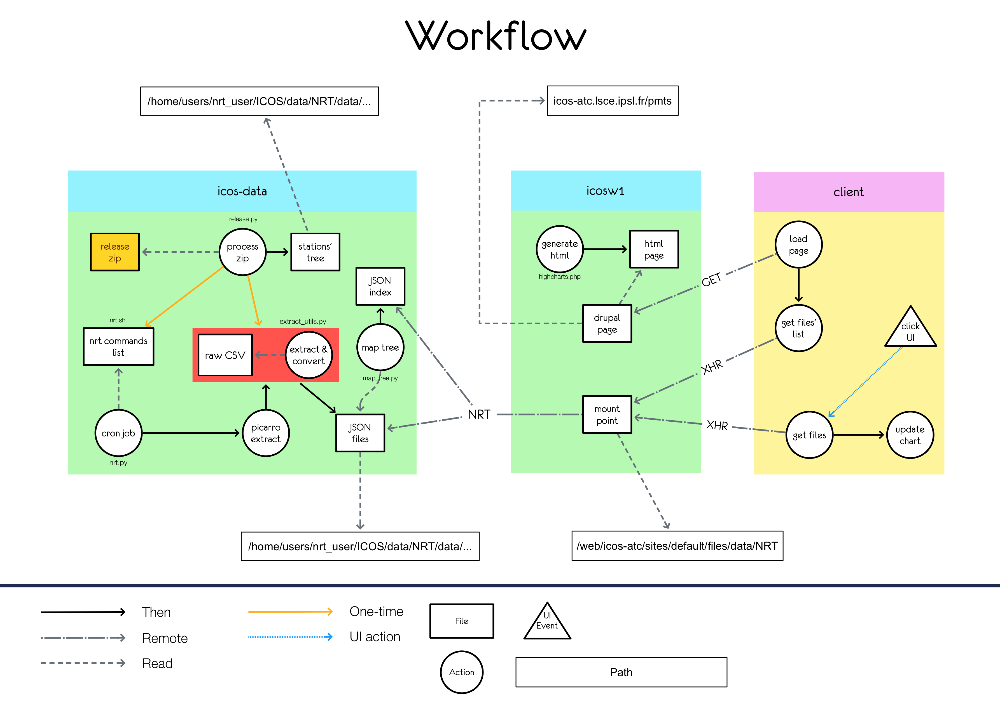

# Introduction

The goal of the datavisualization module is to display data from the release alongside NRT data. 
The data comes from the [Carbon Portal](https://www.icos-cp.eu/).
In order to do so, it was decided that the [Highcharts.js](https://www.highcharts.com/) library would be used.

The global workflow is the following:

## Data-server's side
### Step 1
The first step is to process the release file using the `release.py` script. The job of this script is twofold:

1. Create nested folders to reflect the files of the release (located in the `data` folder), which are in turn populated with the JSON-converted release files
2. Generate a list of commands to be run by cron periodically (`nrt.sh`), which job is to run the nrt extraction

### Step 2
The second step is to run the nrt extraction  and convert the result into web-processable data in the form of JSON. 

The nrt extraction is simply done by running the generated `nrt.sh` file. It runs a command for each entry in the `release` file (making use of the `nrt.py` file to convert the csv files into JSON ones).
The resulting data lives in the `data` folder.

Eventually, an index file listing the different files available is created with the `map_tree.py`(the folder tree is mapped). The resulting file is `index.json` located in the `data` folder (at root level).

### Result
At this point, the data is available and in the correct folders. Moreover, the `index.json` file lists the available paths. It is now up to the web server to fetch and parse this file in order to be able to request sepecific data files.

## Web-server's side

The web server's data folder is an NFS mount point. It comes from the data server.

The datavisualization JavaScript module proceeds as follow:

1. Fetch the `index.json` file
2. Process the file
3. Render the interface using the processed file
4. On "get data" click:
   1. Get the data link
   2. Fetch the file
   3. Add the result to the chart

