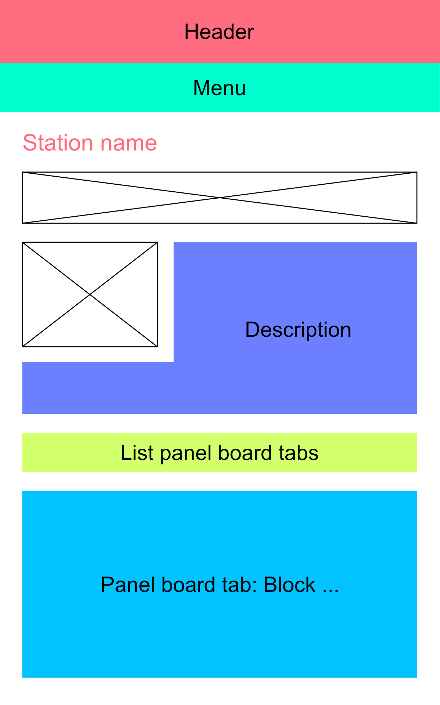

# Panelboards

That piece of documentation is about the panelboards (which you can access from the map or by manually entering the URL `[root]/panelboard/[TRIGRAM]`).

Here are the views I created so far:

* List instruments (`list_instruments`): entity reference to list instruments belonging to a station on a panelboard form
* List panel board tabs (`list_panel_board_tabs`): block listing the tabs on a panel board; entity reference to find tabs in the panel board form
* Panel Board (`panel_board`): the base page for the panel boards
* Panel Board Tab (`panel_board_tab`): individual tab blocks
* Panel Board Trigram Filter (`panel_board_trigram_filter`): used on the tab creation form to attach it to a panel board

## Structure

Here is the panel board mockup:

## Management

### Adding a panelboard

If you want to add a new panel board, click `Content->Add new->Panel board`. The longitude and latitude values will be used to pinpoint the station on a map. The description will be floating to the right of the map. The trigram must be unique and will be used for several purposes, including but not limited to:

* Finding the panel board from other forms such as the tabs
* The URL of the panelboard
* The datavisualization module

The associated tabs will appear under the "tabs" title. You can check or uncheck them depending on whether or not you want each one displayed. To add tabs, see next section. The default tab is the one displayed when you first arrive on the panelboard.

### Adding tabs

To add tabs, click `Content->Add new->Tab ...`. The fields just above the markup are used to generate the images' HTML. You can fill them and then edit the HTML by hand. However, please note that every time you change the fields generating the HTML, the markup will be replaced by the newly-generated HTML. This is merely a convenience tool. The weight field can be used to order the tabs: the lower the weight, the left-most the tab will be in the tabs list. The tab name field corresponds to the text displayed in the tabs list link. Once created, the tab will appear in the associated panelboard. Do not forget to tick the corresponding box from there or else it will not be displayed.